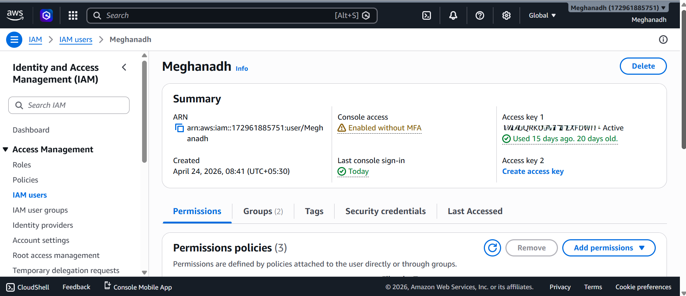
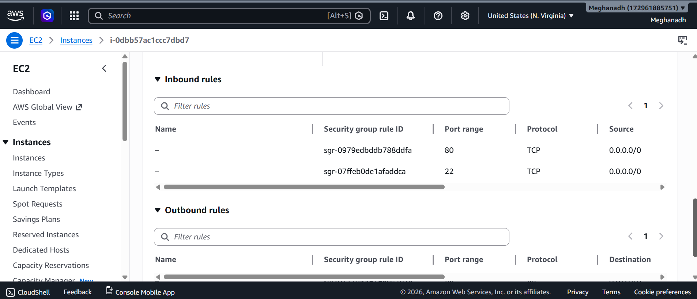
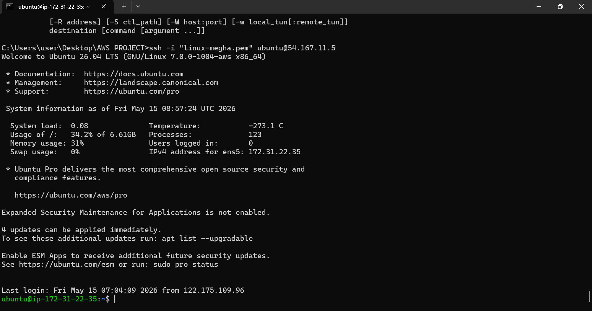
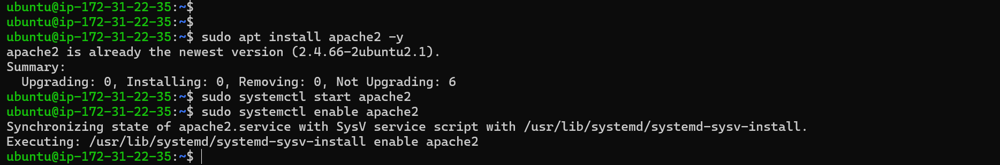
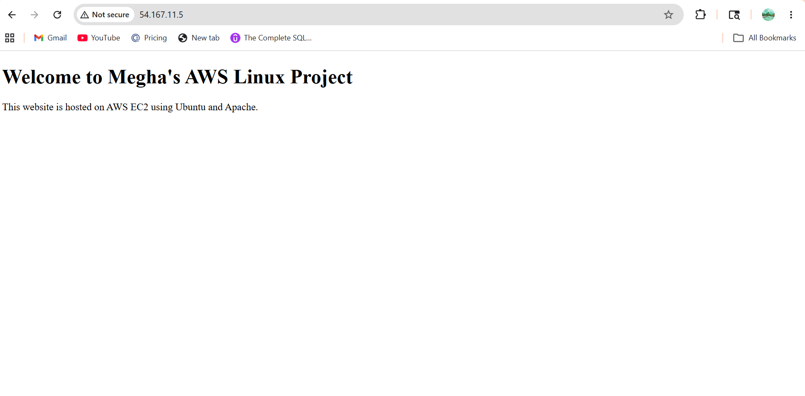

# AWS Linux EC2 Project

## Project Overview
Deployed a secure Linux web server on AWS EC2 using Ubuntu and Apache. Configured IAM users, SSH access, Security Groups, and hosted a sample website.

## Technologies Used
- AWS EC2
- IAM
- Ubuntu Linux
- Apache Web Server
- SSH
- Git & GitHub

## Project Architecture
EC2 Instance → Ubuntu → Apache → Website Deployment

## Screenshots

### IAM User Creation

### Security Group Inbound Rules

### SSH Connection Success

### Apache Installation

### Website Output

